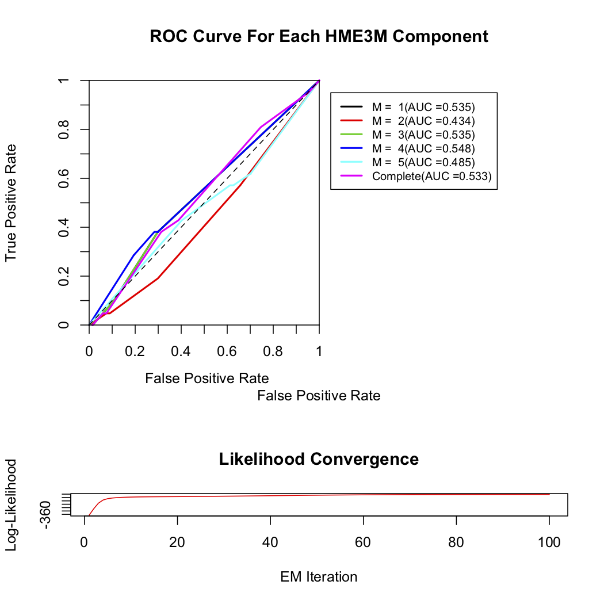

# Version Info
```{r, echo=FALSE, results="hide", warning=FALSE}
suppressPackageStartupMessages({library('NetPathMiner')})
```
<p>
**R version**: `r R.version.string`
<br />
**Bioconductor version**: `r BiocManager::version()`
<br />
**Package version**: `r packageVersion("NetPathMiner")`
</p>

# Introduction

NetPathMiner implements a flexible module-based process flow for network path mining and visualization, which can be fully integrated with user-customized functions. It supports construction of various types of genome scale networks from three different pathway file formats, enabling its utility to most common pathway databases. In addition, NetPathMiner provides different visualization techniques to facilitate the analysis of even thousands of output paths.

This document provides a general overview of the functionalities presented in NetPathMiner (NPM) package. Below, we provide a step-by-step tutorial starting by installation instructions followed by a guide on how to use the package functions perform different network analyses.

To report bugs and arising issues, please visit https://github.com/ahmohamed/NetPathMiner

# Installation Instructions

## System Prerequisites
NPM depends on libxml2 and libSBML to process pathway files.Installation or running certain functions MIGHT fail if these prerequisite libraries are not available. Please read through the following instructions.

#### Prerequisites for Unix users (Linux and Mac OS)
##### Installing libxml2
Make sure your system has library libxml2 installed. In Mac OSX 10.6 or later, libxml2
are built in. For Linux users also, this is almost always the case, however, developing headers
may be missing. To install libxml2 and the headers:

```Shell
    sudo apt-get install libxml2
    sudo apt-get install libxml2-dev
```

##### Installing libSBML
Installing libSBML for Unix users is optional. However, NetPathMiner will not be able to process SBML
files. If you will not use SBML functions, you can skip this part.

From the website of libSBML http://sbml.org/Software/libSBML, you can directly download the
binaries suitable for your system from `Download libSBML` link. You can follow the installation instructions
on the website.

#### Prerequisites for Windows users
If you are installing the package through Bioconductor, you don't have to install external libraries. However, currently the Bioconductor version for Windows doesn't support SBML processing. Alternatively, we have prepared all dependencies in a tar file, downloadable from https://github.com/ahmohamed/NPM_dependencies . Please download the file and place in in the home directory of R (type <code>R RHOME</code> in command prompt to locate it), before installation.

Unless you want to use customized libraries, you can skip the rest of this section.To use customized libraries, you have to compile them and provide them to R at the time of installation. This is not a trivial task, please be sure you really need these custom libraries.

##### Installing libxml2
NetPathMiner expects an enviroment variable `LIB_XML` or `LIB_XML2` pointing to directory where
libxml2 is installed. This directory should have both the compiled library (DLL file) and the header files.

You can download libxml2.dll from http://sourceforge.net/projects/gnuwin32/files/libxml/ among other sources.
Please, place it in a `bin` folder under the installation directory.

You will need also the header files, which can be obtained from NPM_dependecies.tar file. After extracing it, copy
the include directory to the installation directory.

Finally, set the `LIB_XML2` variable to point to the installation directory, which should now contain dll files inder `bin`
and header files under `include`.

##### Installing libSBML
Since libSBML is a C++ libraries, it needs to be compiled using GCC compiler. Unforturantely, there is no binary
version for Windows comipled with GCC. To use libSBML, you need to build it from source.

First, dowload source package from http://sourceforge.net/projects/sbml/files/libsbml/ , extract it. You will
need also MinGW http://www.mingw.org/ or the 64-bit version http://mingw-w64.sourceforge.net/ depending on your system.
Add `mingw/bin` to your PATH, by editing eviroment variables.

Second, you need CMake http://www.cmake.org/ . You can follow the instructions at http://sbml.org/Software/libSBML/docs/java-api/libsbml-installation.html#windows-configuring , however, choose "MinGW Makefiles" instead of "Visual Studio 10".

After finishing the CMake step, use the MinGW's `make.exe` to compile libSBML. Copy the dependencies you used
during the compilation to the `bin` directory. Set the enviroment variable `LIB_SBML` to point the installation
directory, which should now contain dll files inder `bin` and header files under `include`


### R Package dependencies
NetPathMiner depends on package igraph to represent network objects. Installing igraph is required for the package
to work. You will also need devtools package to install directly from github.
NetPathMiner suggests package rBiopaxParser to process BioPAX files and RCurl to download annotations from the web. NetPathMiner can still work without installing the suggested packages, but you will not be able to use the aforementioned functionalities.

##### igraph
Package igraph is available at CRAN. To install it call:
```r
    install.packages("igraph")
```

##### devtools
Package devtools is available at CRAN. For Windows, this seems to depend on
having Rtools for Windows installed. You can download and install this from:
http://cran.r-project.org/bin/windows/Rtools/

To install R package devtools call:
```r
    install.packages("devtools")
```

##### RCurl
For Unix users, make sure your Linux has library libcurl installed. Check out:

```Shell
    locate libcurl
    locate curl-config
```

If these are not found (usually the developer version is missing), most Linux
users will be able to fix this by running:

```Shell
    sudo apt-get install libcurl4-openssl-dev
```

You will now be able to install R package RCurl. In R console:
```r
    install.packages("RCurl")
```

If you encounter other problems check out http://www.omegahat.org/RCurl/FAQ.html

##### rBiopaxParser
Package rBiopaxParser is available on Bioconductor. For installation instructions check
out http://www.bioconductor.org/packages/release/bioc/html/rBiopaxParser.html or
call:

```r
    if (!requireNamespace("BiocManager", quietly=TRUE))
        install.packages("BiocManager")
    BiocManager::install("rBiopaxParser")
```

to install it right away.

### NetPathMiner Installation
If everything went well you will be able to install the NetPathMiner package.

#### From Bioconductor:
In R console, type:

```r
    if (!requireNamespace("BiocManager", quietly=TRUE))
        install.packages("BiocManager")
    BiocManager::install("NetPathMiner")
```


#### From GitHub using devtools:
In R console, type:

```r
    library(devtools)
    install_github(repo="NetPathMiner", username="ahmohamed")
```

# Getting Started
First, let's load the library and the example data set.

```{r Load_package, echo=TRUE, eval=TRUE, results="hide"}
library(NetPathMiner)
```

# Database Extraction
Here we create a network from a pathway file. Pathway files can be downloaded from a verity of databases, like (KEGG)[http://www.kegg.jp/kegg/pathway.html], (Reactome)[http://www.reactome.org/], (Pathway Interaction Database (PID))[http://pid.nci.nih.gov/] and (BioModels)[http://www.ebi.ac.uk/biomodels-main/].

NPM supports processing KGML, SBML and BioPAX. Different databases export pathway information in different formats. Depending on the format you are using, you can choose the corresponding NPM function.

```{r, echo=TRUE, eval=FALSE}
graph <- KGML2igraph(filename = file)
graph <- SBML2igraph(filename = file)
```

Note that SBML2igraph will not work unless you had libSBML during installation. For BioPAX format,
`rBiopaxParser` package is needed.

```{r, echo=TRUE, eval=FALSE}
library(rBiopaxParser)
biopax = readBiopax(file)
graph <- BioPAX2igraph(biopax = biopax)
```

If you want to create a genome-scale network, you may want to process multiple files into a single network. To do that, you can either provide a list of files.

```{r, echo=TRUE, eval=FALSE}
graph <- KGML2igraph(filename = c(file1, file2))
```

or input the directory containing the files.
```{r, echo=TRUE, eval=FALSE}
graph <- KGML2igraph(filename = ".")
```

If you are processing SBML or BioPAX files, you can specify which annotation attributes to extract.

```{r, echo=TRUE, eval=FALSE}
# Extract all MIRIAM identifiers from an SBML file.
graph <- SBML2igraph(filename = file, miriam = "all")

# Extract only miram.go identifiers from a BioPAX file.
graph <- BioPAX2igraph(biopax = biopax, miriam = "go")
```

The above command gives us a bipartite metabolic network. You may be interested in protein-protein interaction, and you would like to get a network in which genes are vertices, and edges represent relationships. In NPM, you can do that by:

```{r, echo=FALSE, eval=TRUE, results="hide"}
file <- file.path(find.package("NetPathMiner"), "extdata", "hsa00860.xml")
```
```{r, echo=TRUE, eval=FALSE, results="hide"}
graph <- KGML2igraph(filename = file, parse.as = "signaling")

graph <- KGML2igraph(filename = file, parse.as = "signaling",
	expand.complexes = TRUE)
```

For this tutorial, we will use an An example metabolic network of Carbohydrate metabolism
extracted from SBML file from Reactome database.

```{r, echo=TRUE, eval=TRUE}
data("ex_sbml")
graph <- ex_sbml
graph
```

# Handling Annotation Attributes
Once we have our network, we can use igraph functions to explore it. First, we view vertices and edges using V() and E() functions respectively.

Network vertices:

```{r, echo=TRUE, eval=TRUE}
head( V(graph) )
```

Edge Vertices:

```{r, echo=TRUE, eval=TRUE}
head( E(graph) )
```

Reaction vertices only:

```{r, echo=TRUE, eval=TRUE}
head( V(graph)[ reactions ] )
```

All vertex annotation attributes are stored in "attr" attribute. To view the annotation for a certain vertex, you can index it by name.

```{r, echo=TRUE, eval=TRUE}
V(graph)[ "reaction_71850" ]$attr
```

Here, our reaction vertex annotations describing the chemical transition. You can also notice annotations starting with "miriam" key word. MIRIAM is a standard format for writing biological identifiers. You can explore the details of this annotation system on http://www.ebi.ac.uk/miriam/main/collections. To list all vertex attributes:

```{r, echo=TRUE, eval=TRUE}
getAttrNames(graph)
```

Since annotations tend to be incomplete, NPM provides a function to check the coverage of each attribute. The function also list the number of vertices having multiple attribute values. For example, vertices with multiple `miriam.kegg.genes` annotations can be view as protein complexes.

```{r, echo=TRUE, eval=TRUE}
getAttrStatus(graph, pattern = "^miriam.")
```

NPM also implements an Attribute Fetcher, where you can convert one annotation to another. The Attribute Fetcher requires RCurl installed, because it uses the online web service of BridgeDb http://www.bridgedb.org/.

```{r, echo=TRUE, eval=FALSE}
require("RCurl")
# Fetch uniprot annotation
graph <- fetchAttribute(graph, organism = "Homo sapiens", target.attr = "miriam.ncbigene" , source.attr = "miriam.uniprot")

# Fetch ChEBI annotation.
graph <- fetchAttribute(graph, target.attr = "miriam.chebi", source.attr = "miriam.kegg.compound")
```

You can also use the Attribute Fetcher to obtain Affymetrix annotation needed for microarray analysis.

# Network Processing
NetPathMiner can convert between different network representations. Given a bipartite metabolic network, reaction network is created by removing metabolite vertices and keeping them as edge attributes. This is useful to get adjacent vertices (now reactions) to have gene annotations needed for gene expression mapping.

```{r, echo=TRUE, eval=TRUE}
rgraph <- makeReactionNetwork(graph, simplify=FALSE)
rgraph
```

Since gene annotations are rarely complete, we can further remove reaction vertices that are missing gene annotations. This is particularly meaningful when reactions are translocation or spontaneous reactions, which are not catalysed by genes. We can then remove such reactions by:

```{r, echo=TRUE, eval=FALSE}
rgraph <- simplifyReactionNetwork(rgraph)
rgraph <- makeReactionNetwork(graph, simplify=TRUE)
```

Some reaction vertices will be catalysed by more than one enzyme. We can `expand` these vertices to get the gene network.

```{r, echo=TRUE, eval=TRUE}
# Expand complexes of gene network.
ggraph <- expandComplexes(rgraph, v.attr = "miriam.uniprot",
		keep.parent.attr= c("^pathway", "^compartment"))

# Convert reaction network to gene network.
ggraph <- makeGeneNetwork(rgraph)
```

`expandComplexes` offers manipulation of network vertices by their attributes, that includes handling missing annotations and annotation inheritance. Refer to the manual for for details.

# Weighting Network
Now that we have our network, we can use gene expression data to weight the network edges. For this example we use an subset of data provided by `ALL` data package. The data consist of microarrays from 128 different individuals with acute lymphoblastic leukemia (ALL).

The gene expression is present as Affymetrix IDs. Since we don't have these annotations in out network, we can use Attribute Fetcher to get them.

```{r, echo=TRUE, eval=TRUE}
data(ex_microarray)

```
```{r, echo=TRUE, eval=FALSE}
# Assign weights to edges.
if(require("RCurl") && url.exists( NPMdefaults("bridge.web") ))
	rgraph <- fetchAttribute(rgraph, organism = "Homo sapiens",
						target.attr = "miriam.affy.probeset",
						source.attr = "miriam.uniprot")
```

Now that we checked that we have `affy.probeset` annotations, we can use the weight function. The default weight function assigns edge weights based on Pearson's correlation of expression profiles of adjacent genes. You can also provide you own function as a `weight.method`. You can refer to the manual of this function for details.

We can also provide sample categories as `y` labels. In that case, edge weights are computed for each label separately. Here we use Leukaemia molecular subtypes as categories.


```{r, echo=TRUE, eval=FALSE}
# This requires an internet connection, and RCurl and ALL packages to be present.
# Instead, we will actually use a processed ALL data, where features are converted
# to miriam.uniprot annotation. (Next chunk)

library(ALL)
data(ALL)
rgraph <- assignEdgeWeights(microarray = exprs(ALL), graph = rgraph,
weight.method = "cor", use.attr="miriam.affy.probeset", y=ALL$mol.bio, bootstrap = FALSE)
```


```{r, echo=FALSE, eval=TRUE}
# This is what is evaluated.
data(ex_microarray)
rgraph <- assignEdgeWeights(microarray = ex_microarray, graph = rgraph,
weight.method = "cor", use.attr="miriam.uniprot", y=colnames(ex_microarray), bootstrap = FALSE)
```

```{r, echo=TRUE, eval=TRUE}
rgraph$y.labels
head( E(rgraph)$edge.weights )
```

# Path Ranking
Edges are now weighted by the correlation of connected genes. We can find highly correlated paths within the network by maximising the edge weight.

NetPathMiner provides two methods to accomplish that. First, `probabilistic.shortest.path` formulates the problem as finding shortest paths in a network by transforming edge weights by their empirical cumulative distribution function (ECDF). Finding the shortest path is equivalent to finding the least probable path given this empirical distribution. The code below gets the 100-shortest paths.

```{r, echo=TRUE, eval=TRUE}
ranked.p <- pathRanker(rgraph, method = "prob.shortest.path",
	K = 25, minPathSize = 6)
```

Second, `value` method finds paths where the sum of edge weights are significantly higher than random paths of similar length. The distribution of random path scores can be estimated by `samplePaths` which uses Metropolis sampling technique. The path sample can be then provided to the path ranking function. If path sample is not provided, random edge sampling is used to estimate the distribution.

```{r, echo=TRUE, eval=FALSE}
pathsample <- samplePaths(rgraph, max.path.length = vcount(rgraph),
num.samples = 1000, num.warmup = 10)

ranked.p <- pathRanker(rgraph, method = "pvalue",
sampledpaths = pathsample ,alpha=0.1)
```

We can get our path set as lists of edge IDs instead.

```{r, echo=TRUE, eval=TRUE}
# Get paths as edge IDs.
eids <- getPathsAsEIDs(paths = ranked.p, graph = rgraph)
```

We can also get paths as edge IDs on another network representation. In this example, we extracted paths from a reaction network. We can get the equivalent paths on the gene network by supplying the corresponding igraph object.

```{r, echo=TRUE, eval=TRUE, results="hide"}
# Convert paths to other networks.
eids <- getPathsAsEIDs(paths = ranked.p, graph = ggraph)
```

# Clustering and classification of paths
The size of the ranked path can be very large, making their analysis challenging. NetPathMiner offers clustering functions to group the ranked path list into few path clusters that can be investigated easily.

```{r, echo=TRUE, eval=TRUE}
# Clustering.
ybinpaths <- pathsToBinary(ranked.p)
p.cluster <- pathCluster(ybinpaths, M = 2)
```
```{r, fig=TRUE, pdf=TRUE, echo=TRUE, eval=TRUE}
plotClusters(ybinpaths, p.cluster)
```

We can also identify a set of paths that best classify a sample category (as a form of biomarker for example). The code below creates a classifier for `BCR/ABL` subtype. Since our network is very small, we are not able to create an accurate classifier.

```{r, echo=TRUE, eval=TRUE}
p.class <- pathClassifier(ybinpaths, target.class = "BCR/ABL", M = 2)
```

```{r, echo=TRUE, eval=FALSE}
plotClassifierROC(p.class)
```



```{r, fig=TRUE, pdf=TRUE, echo=TRUE, eval=TRUE}
plotClusters(ybinpaths, p.class)
```


# Plotting
NetPathMiner offers several plotting options for networks and ranked paths. First, we can plot our network colouring vertices by their cellular compartment.

```{r, echo=TRUE, eval=TRUE}
plotNetwork(rgraph, vertex.color="compartment.name")
```

NetPathMiner's plotPaths function can be used to view ranked paths on the network structure. Cluster information can also be provided, so that paths belonging to the same cluster will have the same colour.

```{r, fig=TRUE, pdf=TRUE, echo=TRUE, eval=FALSE}
plotPaths(ranked.p, rgraph)

# With clusters
plotPaths(ranked.p, graph, path.clusters=p.class)
```

To view paths on different network representations, you can pass the networks as parameters to plotPaths, and it will do the job.

```{r, fig=TRUE, pdf=TRUE, echo=TRUE, eval=TRUE}
plotAllNetworks(ranked.p, metabolic.net = graph, reaction.net = rgraph,
		path.clusters=p.class, vertex.label = "", vertex.size = 4)
```

To make use of the annotation attributes, NetPathMiner can layout vertices such that those sharing a common attribute value are plotted close to each other, and using similar colors.

```{r, echo=TRUE, eval=FALSE}
layout.c <- clusterVertexByAttr(rgraph, "pathway", cluster.strength = 3)
v.color <- colorVertexByAttr(rgraph, "pathway")
plotPaths(ranked.p , rgraph, clusters=p.class,
	layout = layout.c, vertex.color = v.color)
```

Finally, for interactive visualization using Cytoscape, plotCytoscapeGML can export the graph, attributes and layout as a GML file, which can be imported directly into Cytoscape. For example:

```{r, echo=TRUE, eval=FALSE}
plotCytoscapeGML(graph, file="example.gml", layout = layout.c,
				vertex.size = 5, vertex.color = v.color)
```

# Additional functions
## Genesets and geneset subnetworks
NetPathMiner provides functions to extract genesets utilizing annotation attributes in the network. To get genesets as lists of genes for geneset enrichment analyses:

```{r, echo=TRUE, eval=TRUE, results="hide"}
getGeneSets(graph, use.attr="compartment", gene.attr="miriam.uniprot")
```

Alternatively, genesets can be obtained as network structures.

```{r, echo=TRUE, eval=TRUE, results="hide"}
getGeneSetNetworks(graph, use.attr="compartment")
```

## Integration with graph package
All networks constructed in NetPathMiner are represented as igraph object. Users can convert these networks to Bioconductor's graphNEL object using `toGraphNEL` function

```{r, echo=TRUE, eval=FALSE}
graphNEL <- toGraphNEL(graph, export.attr="^miriam.")
```
